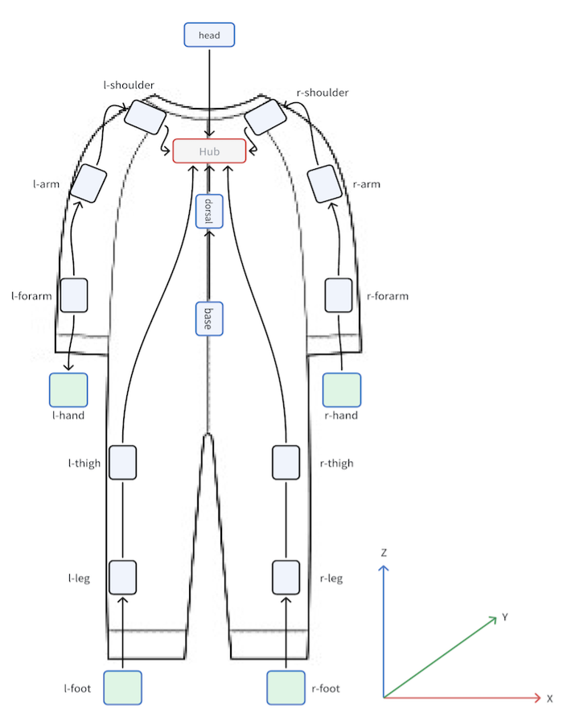

# IO Dataset

## Data Acquisition

You can fill in [here](https://forms.gle/fDdyipTKDZaL34zC6) to join the waiting list, or contact us through [io@io-ai.tech](mailto:io@io-ai.tech).

Open data only contains 4 RGB image sequences and EE pose of the hand, other data please contact us separately.


## Dataset Structure

Each group of data is a tar compressed package, named XXX.tar, and each compressed package contains several trajectories, each track is a folder, and the folder name is from XXX_000 to XXX_00N, where N is the number of trajectories in each group of data.

Each folder contains the following files:

```
XXX_[ddd]
├── annotation.json
├── audio
│   └── audio_{timestamp}.pcm
└── images/
│   ├── cam_fisheye
│   │   └── [dddddd]_{timestamp}.jpg
│   ├── cam_left
│   │   └── [dddddd]_{timestamp}.jpg
│   ├── cam_rgb
│   │   └── [dddddd]_{timestamp}.jpg
│   ├── cam_depth
│   │   └── [dddddd]_{timestamp}.png
│   └── cam_right
│       └── [dddddd]_{timestamp}.jpg
├── mocap/
│   └── *.csv
├── haptics
│   └── *.csv
├── calibration
│   └── *.yml
└── process_results
    └── ee_pose.csv
```

## Annotation File Description

The annotation file is in json format, and the file name is annotation.json, and the file content is as follows:

```json
{
  "belong_to": "20240527_assemble_gripper_caid_06",
  "sequence_id": 4,
  "start_frame_id": 708,
  "end_frame_id": 888,
  "description": "Assemble the claw gripper"
}

```

The "images" folder contains five subfolders, namely "cam_fisheye", "cam_left", "cam_rgb", "cam_depth" and "cam_right", corresponding to different camera perspectives. (The "cam_depth" is a depth image, which is too large to be released on the open platform)

Each subfolder contains several images, and the image naming format is FRAMEID{:06d}_TIMESTAMP{:d}.ext. The FRAMEID ranges from the start_frame_id to the end_frame_id specified in the annotation file. TIMESTAMP represents the timestamp of the image acquisition, measured in nanoseconds, and ext denotes the image format. Depth images are 16-bit single-channel PNG images (lossless compression), while other images are in JPEG format. For example, 001505_1716792351875812408.jpg.

For certain perspectives, there may be missing frames, which means that the image file for that frame number will not be present in the folder.

## Mocap Data Description

`mocap/*.csv` file contains motion capture data. The columns are as follows:

- `seq`: Record sequence number
- `timestamp`: Timestamp (nanoseconds)
- `q_w, q_x, q_y, q_z`: Pose (quaternion)
- Other data descriptions to be added
-
> Some data may be lost due to device reasons, and the empty line will be present in this row

The coordinate system definition can be referred to [URDF](https://github.com/ioai-tech/data_example/blob/main/human.urdf).

The motion capture sensor and the human skeleton correspond to the figure as follows:



## Haptics Data Description

Haptics sensors are divided into hand sensors and foot sensors, and stored in CSV format.

The correspondence table between sensors and file names is as follows:

|Sensor|File Name|
| --- | --- |
|Left hand| touch-l-hand.csv |
|Right hand| touch-r-hand.csv |
|Left foot| touch-l-foot.csv |
|Right foot| touch-r-foot.csv |

Each hand has 10 points, corresponding to 5 fingers, and the data range is [0, 65535]. The larger the value, the greater the pressure on that point.
Each foot has 99 points and the data range is [0, 4095]. The smaller the value, the greater the pressure on that point.

The header of the CSV file is as follows:

|seq|timestamp|contact_0|contact_1|contact_2|contact_3|contact_4|……|
| --- | --- | --- | --- | --- | --- | --- | --- |


## End Effector Pose Description

The `XXX_0NN_ee_pose.csv` file (where XXX is the corresponding trajectory folder name) contains the poses of the left and right end effectors (center of the back of the left and right hands) in the cam_rgb coordinate system. The columns are as follows:

- `seq`: Record sequence number
- `timestamp`: Timestamp (nanoseconds)
- `left_ee_pos_x, left_ee_pos_y, left_ee_pos_z`: Position of the left end effector
- `left_ee_quat_w, left_ee_quat_x, left_ee_quat_y, left_ee_quat_z`: Orientation of the left - end effector (quaternion)
- `right_ee_pos_x, right_ee_pos_y, right_ee_pos_z`: Position of the right end effector
- `right_ee_quat_w, right_ee_quat_x, right_ee_quat_y, right_ee_quat_z`: Orientation of the - right end effector (quaternion)

## 相机标定文件格式

If the camera has been calibrated, a configuration file with the same name as the camera image folder will be included in the calibration folder, for example, cam_fisheye.yml.

File example as follows:

```yml
image_width: 1280
image_height: 1024
camera_name: cam_fisheye
camera_matrix:
  rows: 3
  cols: 3
  data: [435.09697,   1.3845 , 640.69483,
           1.     , 433.14429, 510.82893,
           2.     ,   0.     ,   1.     ]
distortion_model: equidistant
distortion_coefficients:
  rows: 1
  cols: 4
  data: [-0.126101, 0.439819, -0.592622, 0.201684]
rectification_matrix:
  rows: 3
  cols: 3
  data: [1., 0., 0.,
         0., 1., 0.,
         0., 0., 1.]
projection_matrix:
  rows: 3
  cols: 4
  data: [435.09697,   1.3845 , 640.69483,   0.     ,
           1.     , 433.14429, 510.82893,   0.     ,
           2.     ,   0.     ,   1.     ,   0.     ]
```
